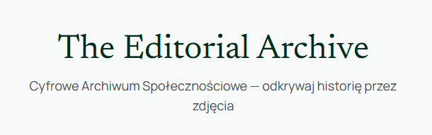

# The Editorial Archive



Platforma do przechowywania, przeglądania i wyszukiwania historycznych zdjęć.

---

## Architektura

```
frontend (React)  ──REST API──►  backend (Spring Boot)  ──JDBC──►  PostgreSQL
                                         │
                                         ▼
                                   MinIO / S3
```

---

### Wymagania

- **Docker Desktop** 4.x+
- **Java 21** (JDK)
- **Maven 3.9+**
- **Node.js 20+** + **npm**

### Baza danych (PostgreSQL + MinIO)

```bash
docker compose -f docker-compose.dev.yml up -d
```

- PostgreSQL: `localhost:5432`
- MinIO Console: http://localhost:9001 (login: `minioadmin` / `minioadmin`)

### Konfiguracja i uruchomienie backendu

```bash
cd editorial-archive-backend
mvn spring-boot:run
```

Swagger UI: `http://localhost:8080/swagger-ui.html`

### Konfiguracja i uruchomienie frontend

```bash
cd editorial-archive-frontend
npm install
npm run dev
```

Frontend dostępny na: http://localhost:5173

---

### Uruchomienie

```bash
docker compose -f docker-compose.dev.yml up -d
cd editorial-archive-backend && ./mvnw spring-boot:run -Dspring-boot.run.profiles=dev
cd editorial-archive-frontend && npm run dev
```
