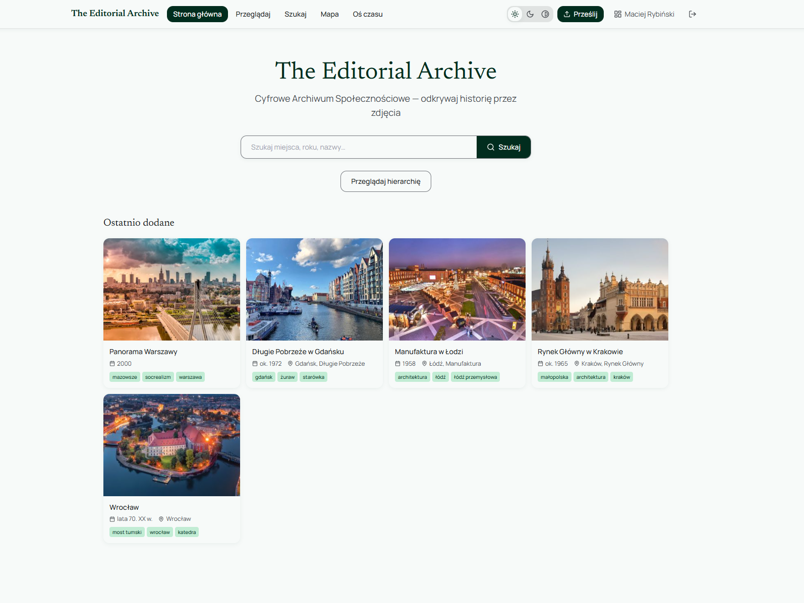
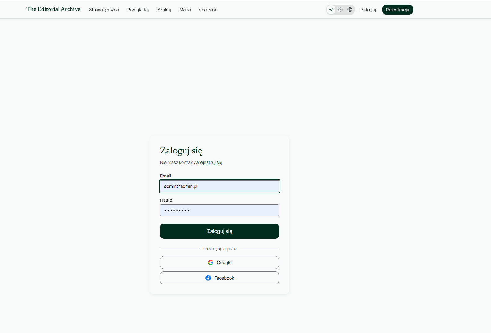
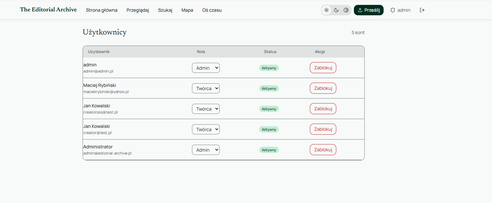
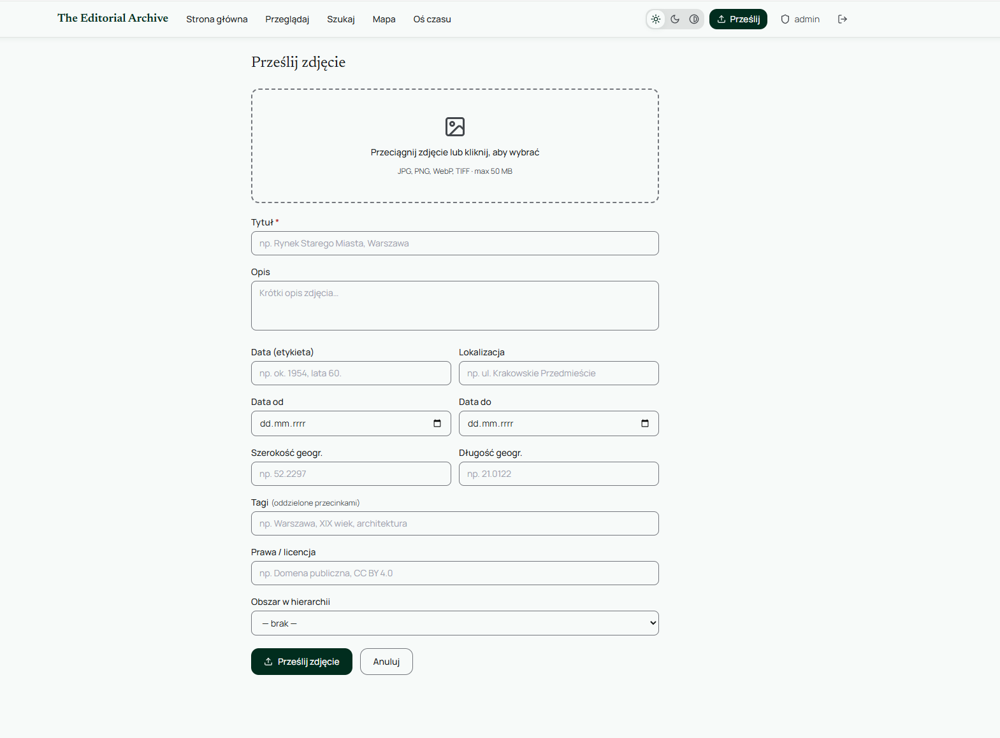

# The Editorial Archive — Dokumentacja techniczna

Cyfrowe Archiwum Społecznościowe (projekt ATSUZ).



---

## 1. Stack

| Warstwa | Technologia |
|---------|------------|
| Frontend | React 18 + TypeScript + Vite + Tailwind CSS |
| Backend | Spring Boot 3.2 / Java 21 |
| Baza danych | PostgreSQL 15 + Flyway |
| Object storage | MinIO (kompatybilny z S3) |
| Autentykacja | JWT (HMAC-SHA256) + OAuth2 (Google, Facebook) |
| Konteneryzacja | Docker Compose |

---

## 2. Architektura systemu

```
Przeglądarka
    │
    ▼
Nginx (frontend :80)
    │ proxy /api, /oauth2
    ▼
Spring Boot (:8080)
    ├── PostgreSQL (:5432)
    └── MinIO (:9000)
```

### Komunikacja między komponentami

- Backend zorganizowany w pakiety domenowe: `user`, `photo`, `hierarchy`, `tag`, `audit`. Każdy zawiera JPA, repozytorium, serwis i kontroler REST.

- Pliki są przechowywane w MinIO (S3). Backend udostępnia klientom **presigned URLs** (ważne 3600 s) — pobieranie odbywa się bezpośrednio z MinIO, omijając backend.

- Miniatury generowane **asynchronicznie** (`@Async`) po upload — API zwraca `201` natychmiast, `thumbnailUrl` może być chwilowo `null`.

- Autentykacja JWT: access token (HMAC-SHA256, TTL 15 min) + refresh token (hash SHA-256 w DB, TTL 7 dni, rotacja przy każdym użyciu). OAuth2 dla Google/Facebook — sesja `IF_REQUIRED` tylko podczas handshake.

- Logi zapisywane w `audit_logs` z informacją o akcji, aktorze i timestampie. Niemodyfikowalny zapis operacji krytycznych (upload, edycja, usunięcie).

- Identyfikacja zasobów: UUID (techniczny, w URL) + `accession_number` (czytelny, stały, dla referencji zewnętrznych). Numer akcesji generowany przez trigger PostgreSQL (`ARC-00001`).

- Wyszukiwanie tekstowe realizowane przez PostgreSQL FTS (`TSVECTOR` z wagami A–D, `ts_rank`), bez potrzeby zewnętrznego silnika (np. Elasticsearch). Hierarchiczne przeglądanie realizowane przez rekurencyjne CTE.

- Dostępność: skip-link, alt text, aria-attributes, trzy tryby kolorystyczne (light/dark/contrast), pełna nawigacja klawiaturą, `<html lang="pl">`.

## Endpointy API (v1)

| Grupa | Metoda | Endpoint | Auth |
|-------|--------|----------|------|
| Auth | POST | `/api/v1/auth/register` | Public |
| Auth | POST | `/api/v1/auth/login` | Public |
| Auth | POST | `/api/v1/auth/refresh` | Public |
| Auth | POST | `/api/v1/auth/logout` | Wymagana |
| Auth | GET | `/api/v1/auth/me` | Wymagana |
| Zdjęcia | GET | `/api/v1/photos` | Public |
| Zdjęcia | GET | `/api/v1/photos/search` | Public |
| Zdjęcia | POST | `/api/v1/photos` | CREATOR+ |
| Zdjęcia | PATCH | `/api/v1/photos/{id}/status` | ADMIN |
| Hierarchia | GET | `/api/v1/hierarchy` | Public |
| Hierarchia | GET | `/api/v1/hierarchy/{id}` | Public |
| Hierarchia | GET | `/api/v1/hierarchy/{id}/breadcrumbs` | Public |
| Hierarchia | POST | `/api/v1/hierarchy` | ADMIN |
| Hierarchia | PUT | `/api/v1/hierarchy/{id}` | ADMIN |
| Hierarchia | DELETE | `/api/v1/hierarchy/{id}` | ADMIN |
| Tagi | GET | `/api/v1/tags` | Public |
| Admin | GET | `/api/v1/admin/audit` | ADMIN |
| Admin | GET | `/api/v1/admin/stats` | ADMIN |
| Auth | GET | `/oauth2/authorization/google` | Public |
| Auth | GET | `/oauth2/authorization/facebook` | Public |
| Użytkownicy | GET | `/api/v1/users` | ADMIN |
| Użytkownicy | PATCH | `/api/v1/users/{id}/block` | ADMIN |
| Użytkownicy | PATCH | `/api/v1/users/{id}/role` | ADMIN |
| Użytkownicy | DELETE | `/api/v1/users/{id}` | ADMIN |

Pełna dokumentacja: http://localhost:8080/swagger-ui.html

---

## 3. Autentykacja i autoryzacja

**JWT** — access token (HMAC-SHA256, TTL 15 min) + refresh token (hash SHA-256 w DB, TTL 7 dni, rotacja przy każdym użyciu).

**OAuth2** — Google i Facebook. Po sukcesie Spring Security przekierowuje do `/auth/callback?token=...&refresh=...`.



### Role

| Rola | Nadawana | Uprawnienia |
|------|----------|------------|
| `VIEWER` | ręcznie przez ADMIN; Użytkownik anonimowy/niezalogowany | tylko odczyt publicznego API; Możliwość przeglądania zdjęć; |
| `CREATOR` | domyślna przy rejestracji | upload, edycja i usunięcie własnych fotografii |
| `ADMIN` | ręcznie przez ADMIN | moderacja, zarządzanie użytkownikami / hierarchią / tagami, logi |



---

## 4. Model danych

Sześć tabel:

| Tabela | Opis |
|--------|------|
| `users` | konta użytkowników (LOCAL/GOOGLE/FACEBOOK) |
| `photos` | główny zasób — fotografia z metadanymi |
| `hierarchy_nodes` | drzewo geograficzne (kraj→województwo→miasto→dzielnica, max 5 poziomów) |
| `tags` | słowa kluczowe; `photo_tags` — tabela join N:M |
| `audit_logs` | niemodyfikowalny log operacji |
| `refresh_tokens` | hashe tokenów odświeżania |

Relacje: `Photo` → `User` (uploader), `Photo` → `HierarchyNode`, `Photo` ↔ `Tag` (N:M), `User` → `AuditLog` (actor).

Schemat zarządzany przez Flyway (V001 tabele, V002 indeksy + triggery FTS + numery akcesji, V003 seed danych). JPA ustawione na `ddl-auto: validate`.

### Cykl życia fotografii

Oznaczony statusami:

```
upload → PENDING → APPROVED  (widoczna publicznie)
                 → REJECTED
                 → NEEDS_CORRECTION → [CREATOR edytuje] → PENDING
```

---

## 5. Metadane fotografii

**Techniczne** (generowane przez system): `id`, `accession_number` (format `ARC-00001`, trigger PostgreSQL), `storage_key`, `thumbnail_key`, `medium_key`, `mime_type`, `file_size_bytes`, `width_px`, `height_px`, `status`, `view_count`.

**Opisowe** (podawane przez twórcę):

| Pole | Opis |
|------|-------|
| `title` | Tytuł (wymagany) |
| `description` | Opis treści/kontekstu |
| `hierarchy_node_id` | Przynależność hierarchiczna |
| `tags[]` | Tagi (auto-create przy braku) |
| `photo_date_from` / `photo_date_to` | Zakres daty |
| `photo_date_label` | Czytelna etykieta, np. `ok. 1954` |
| `location_name` / `latitude` / `longitude` | Lokalizacja |
| `rights_statement` | Licencja |

Trzy warianty pliku: oryginalny, thumbnail (400 px), medium (1200 px) — wszystkie JPEG, proporcje zachowane (biblioteka Thumbnailator).



---

## 6. Architektura informacji

Cztery ścieżki dostępu do fotografii:

| Ścieżka | Mechanizm |
|---------|----------|
| Wyszukiwanie tekstowe (`/search`) | PostgreSQL FTS (`TSVECTOR`, wagi A–D, `ts_rank`) |
| Przeglądanie hierarchiczne (`/explore`) | filtr po węźle + rekurencyjne CTE (wszyscy potomkowie) |
| Mapa (`/map`) | fotografie z koordynatami GPS |
| Oś czasu (`/timeline`) | grupowanie po `photo_date_from` |


---

## 7. Dostępność (WCAG 2.1 AA)

- Skip-link `#main-content` jako pierwszy element każdej strony
- `` na wszystkich komponentach fotografii
- `aria-pressed` (ThemeToggle), `aria-expanded` (hamburger menu)
- Trzy tryby kolorystyczne: `light`, `dark`, `contrast` (wysoki kontrast)
- Cała nawigacja dostępna z klawiatury (Tab/Enter/Space)
- `<html lang="pl">`

---
